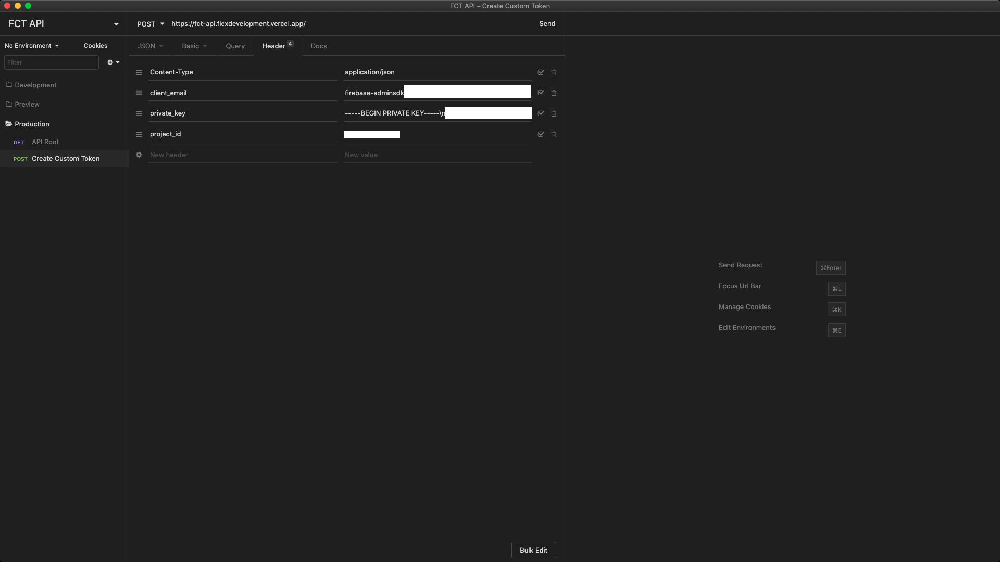
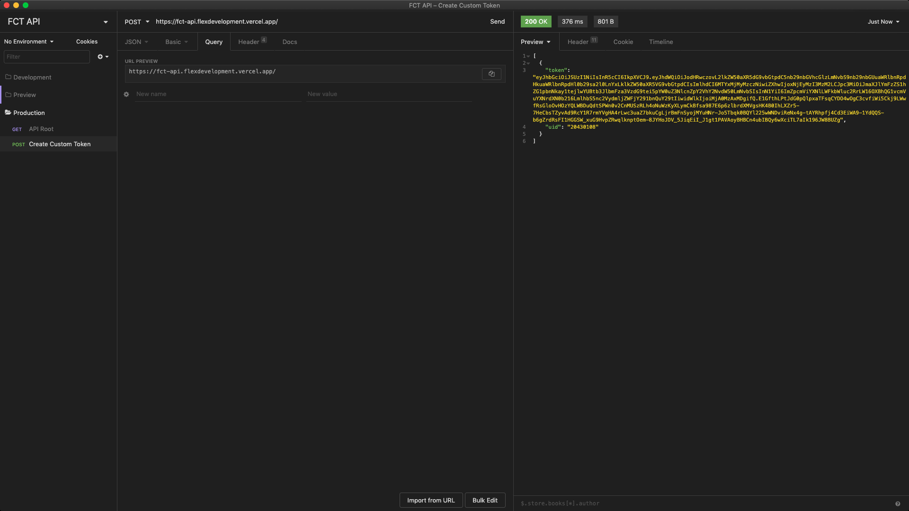
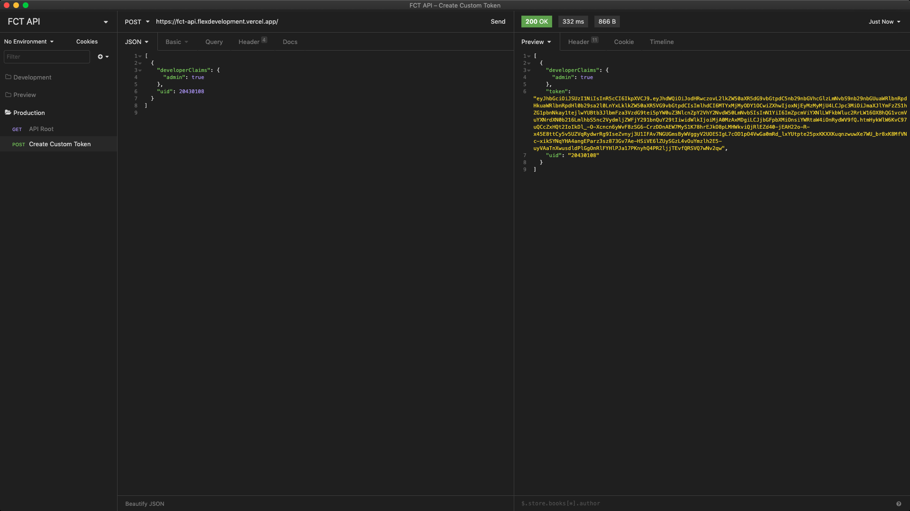
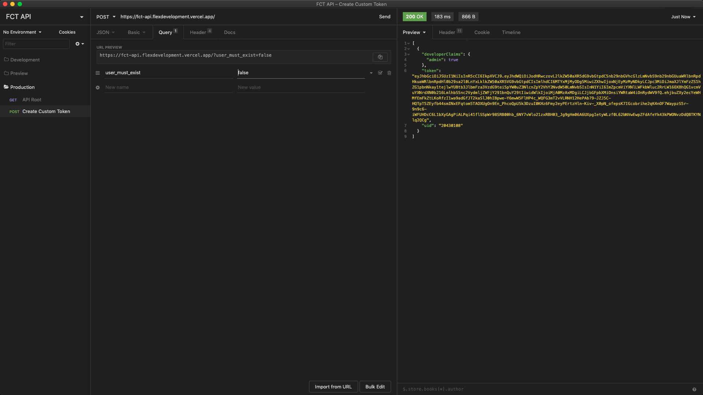

# Firebase Custom Token API

Create custom tokens for Firebase via API endpoint

[](https://www.typescriptlang.org/)

## Overview

[Getting Started](#getting-started)  
[Usage](#usage)  
[Built With](#built-with)  
[Contributing](docs/CONTRIBUTING.md)  
[Deployment](docs/DEPLOYMENT.md)

## Getting Started

The Firebase Custom Token (FCT) API is a single serverless endpoint that can be
used to generate custom tokens for Firebase.

For more information, see [Create Custom Tokens][1] from the Firebase docs.

## Usage

### Authorization

The `headers` field of every request should include the following keys:

- `client_email`
- `private_key`
- `project_id`



The required keys can be found by generating a private key file from the
Firebase Console:

1. Open **Settings > Service Accounts**
2. Click **Generate New Private Key**; confirm by clicking **Generate Key**
3. Securely store the JSON file containing the key

### Create Custom Token

Generate a custom token for a single user or batch of users, as well as
optionally specify additional claims to be included in each token.

- **URL**: `https://fct-api.flexdevelopment.vercel.app`
- **Method**: `POST`

#### Query Parameters

| name              | type      | default | required | description                                         |
| ----------------- | --------- | ------- | -------- | --------------------------------------------------- |
| `user_must_exist` | `boolean` | `true`  | `false`  | check if user exists before generating custom token |

#### Request Body

The `body` of every request should have the following shape:

```json
[
  {
    "uid": 20430108
  }
]
```

Custom claims can also be specified for each user:

```json
[
  {
    "developerClaims": {
      "admin": true
    },
    "uid": 20430108
  }
]
```

#### Sample Response

#### Default



#### With `developerClaims`



#### With `user_must_exist: false`



### Errors

If an error is thrown, it will have the following shape:

```json
{
  "name": "GeneralError",
  "message": "",
  "code": 500,
  "className": "general-error",
  "data": {
    "body": "",
    "query": {
      "compile": true,
      "options": {}
    }
  },
  "errors": {}
}
```

#### 404 Sample

```json
{
  "name": "NotFound",
  "message": "There is no user record corresponding to the provided identifier.",
  "code": 404,
  "className": "not-found",
  "data": {
    "codePrefix": "auth",
    "req": {
      "body": [
        {
          "uid": -1
        }
      ],
      "query": {
        "user_must_exist": true
      }
    }
  },
  "errors": {
    "code": "auth/user-not-found",
    "uid": -1
  }
}
```

## Built With

- [Firebase Admin][2] - Interact with Firebase from privileged environments
- [Vercel][3] - Hosting platform for serverless functions

[1]: https://firebase.google.com/docs/auth/admin/create-custom-tokens
[2]: https://firebase.google.com/docs/admin/setup
[3]: https://vercel.com/docs/serverless-functions/introduction
